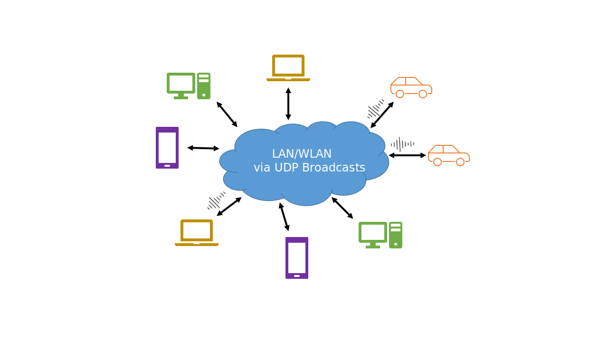

# Flurfunk
## _Low-latency audio communication on local network_

`Flurfunk` provides software for local area network audio communication based on UDP broadcasts. This allows for a very simple but fast audio communication without Internet access. The audio stream is optimized for voice (8bit, 24kHz) and roughly takes 1.5MByte per minute per active (speaking) client.



## Features

- UDP broadcasts (no central server needed)
- Low latency and low data bandwidth
- Protocol frame for future extensions

## Dependencies

- `bass` (great audio framework from [un4seen](http://www.un4seen.com/))
- `Qt5` (Qt5.12.0+ recommended)

## Supported Platforms

- Windows x86_64
- Linux/Ubuntu x86_64
- Android armeabi-v7a
- Raspberry Pi arm
- and many more (thanks to Qt/bass)


## Build from Source

```
git clone https://github.com/pberthold/Flurfunk.git
cd Flurfunk/main/src
mkdir Build
cd Build
qmake ..
make
```

## Releases

The releases come with the dependencies and should run out of the box. The application settings are stored in the folder of the executable (100% portable).
