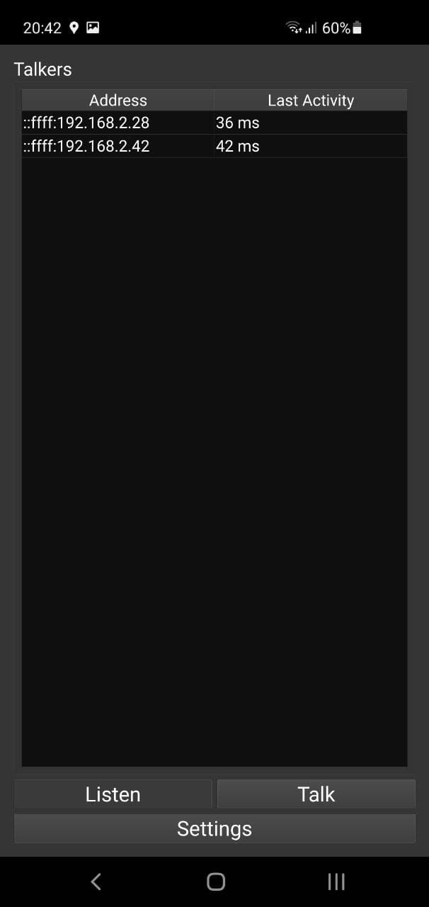

# Flurfunk
## _Low-latency audio communication on local network_

`Flurfunk` provides software for local area network audio communication based on UDP broadcasts. This allows for a very simple but fast audio communication without the need of any central server unit or Internet access. The audio stream is optimized for voice (8bit, 24kHz) and roughly takes 1.5MByte per minute per active (speaking) client. The audio data is uncompressed and pulse-coded (PCM) to increase robustness in mobile applications with weak WiFi signal strength.


## Features

- UDP broadcasts (no central server needed)
- Low latency and uncompressed
- Protocol frame for backwards-compatibility of future extensions
- Configuration for audio devices and startup behaviour
- Portable (settings stored in ini-file)

## Dependencies

- `bass` (great audio framework from [un4seen](http://www.un4seen.com/))
- `Qt5` (Qt5.12.0+ recommended)

## Supported Platforms

- Windows x86_64
- Linux/Ubuntu x86_64
- Android armeabi-v7a
- Raspberry Pi arm
- and many more (thanks to Qt/bass)



## Build from Source

```
git clone https://github.com/pberthold/Flurfunk.git
cd Flurfunk/main/src
mkdir Build
cd Build
qmake ..
make
```

## Releases

The releases come with the dependencies and should run out of the box. The application settings are stored in the folder of the executable (100% portable).
